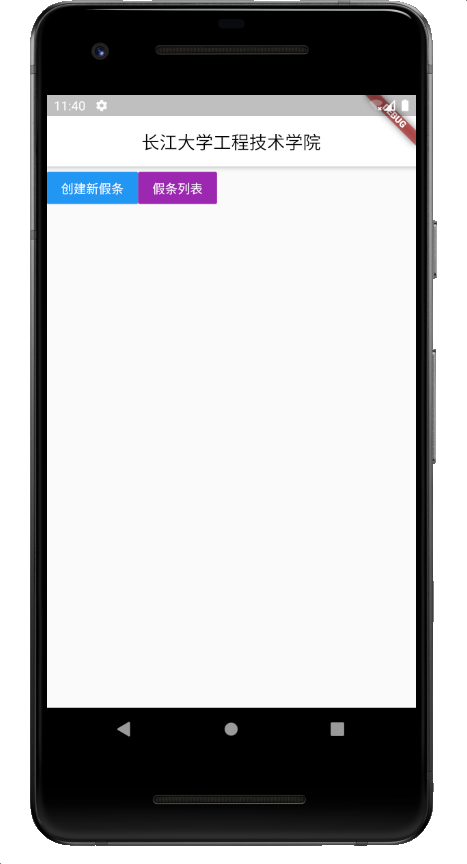
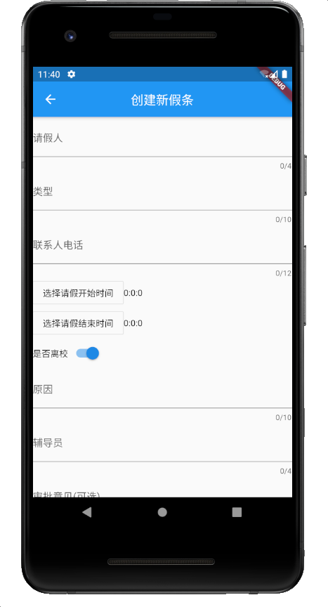
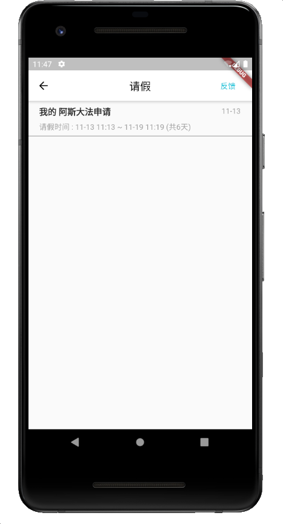
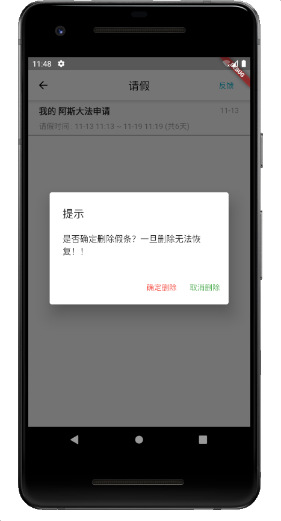

# school

该app复制了《今日学校》的请假界面，由flutterv1.22 build。

以下是功能介绍：

基本界面：

创建假条界面

创建假条的默认定位为 **中国湖北省荆州市荆州区G318(沪聂线)** 若需要定制则自行修改

注意⚠️ **请假时间开始时间和结束时间**为必选项！！！如果不选择则无法创建假条！！！

请假列表页面

长按单个假条则弹出删除弹窗

点击假条则进入假条详情

点击下方的去销假按钮则转换为销假页面

再次点击则转换为请假中。
